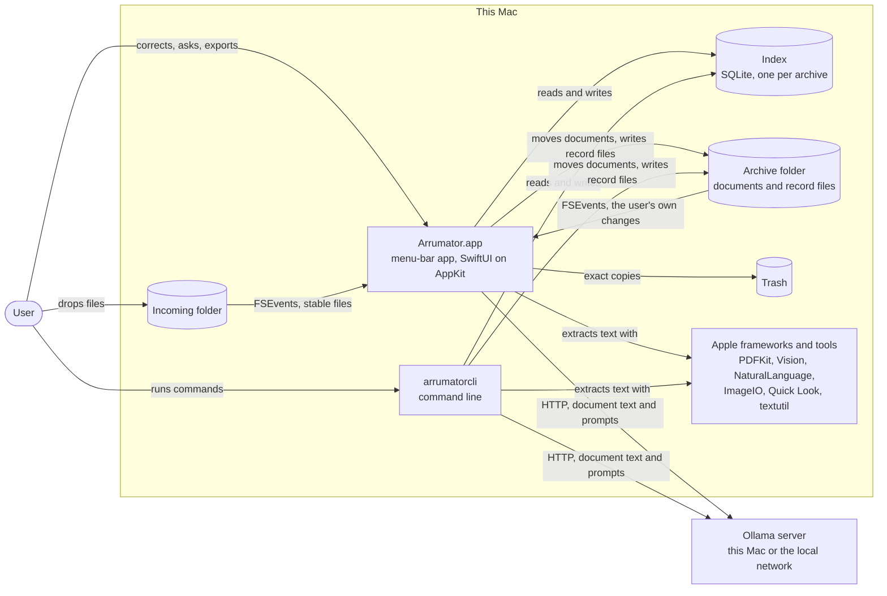
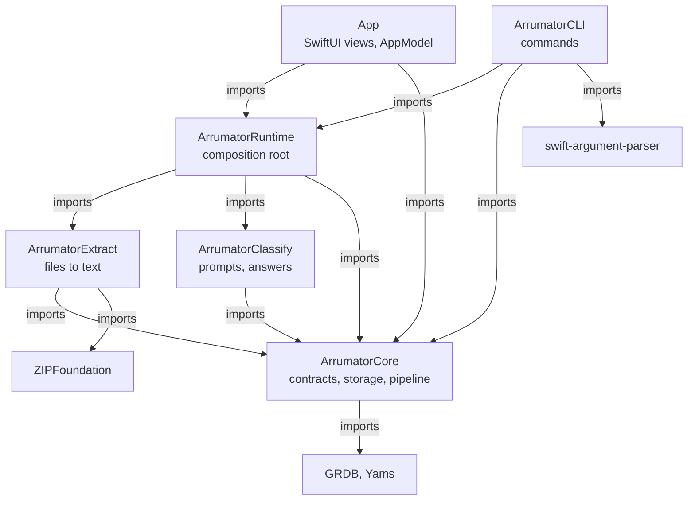
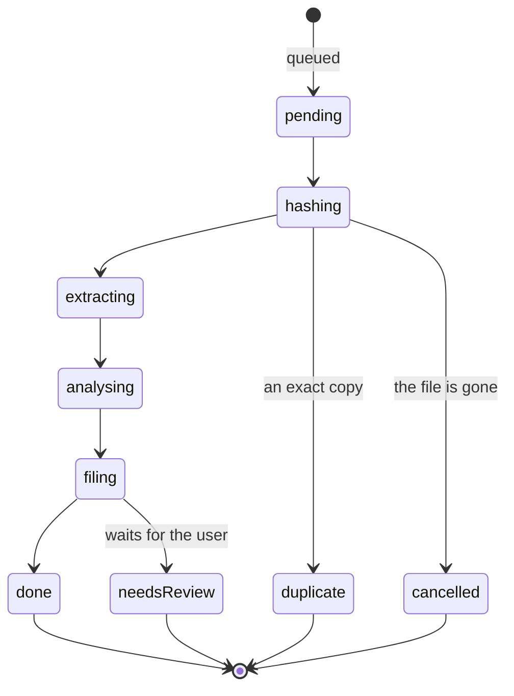

# Architecture

How Arrumator is built: what it must guarantee, how the code is divided, how the parts work together while a document
is read and filed, and which decisions hold it in that shape. [How Arrumator works](how-it-works.md) says what the
pipeline does, and [Storage](storage.md) where everything is kept; this document says how the code is arranged to do
it. The rules are in [AGENTS.md](../AGENTS.md); this explains the structure they protect, and the
[review guidelines](review/code-review.md) say how a change is checked against both. It describes the design the code
is held to: where the code does otherwise, that is a defect for a review to find, unless
[Limits to know](#limits-to-know) names it.

The outline is [arc42](https://arc42.org/overview)'s, trimmed to what a reader needs ("document only what your
stakeholders need", [arc42 FAQ](https://faq.arc42.org/questions/B-1/)). The diagrams are the context and container
levels of the [C4 model](https://c4model.com/diagrams) and one module graph; classes are not drawn, as the code shows
them. Reference material that already has an owner is linked, never copied: the module table in
[AGENTS.md §5](../AGENTS.md#5-boundaries), the record files in [Storage](storage.md), the settings in
[Using Arrumator](using-arrumator.md#configuration).

- [What the architecture is for](#what-the-architecture-is-for)
- [Constraints](#constraints)
- [Context](#context)
- [Strategy](#strategy)
- [Building blocks](#building-blocks)
- [At run time](#at-run-time)
- [Concurrency](#concurrency)
- [What runs through everything](#what-runs-through-everything)
- [Decisions](#decisions)
- [Quality scenarios](#quality-scenarios)
- [What keeps it in shape](#what-keeps-it-in-shape)
- [Limits to know](#limits-to-know)
- [Changing the architecture](#changing-the-architecture)
- [Words](#words)
- [Sources](#sources)

## What the architecture is for

Arrumator files people's personal documents, so the first two goals outrank everything else, and a change that helps a
lower goal at the cost of a higher one is refused.

| # | Goal | What it means here | Rule |
|---|---|---|---|
| 1 | **Privacy: everything stays local** | Document text, file names and what the model says of them reach only the machines the user runs: this Mac and the user's own Ollama server. | [§4.1](../AGENTS.md#4-hard-rules-non-negotiable) |
| 2 | **Data safety** | No code path deletes a document, every move can be undone, and losing the index loses time, never information. | §4.2 |
| 3 | **Auditability** | Every decision about a document can be traced to its inputs, the prompts, the model's raw answers and their timing. | §4.4 |
| 4 | **Resumability** | Work stopped by quitting, a crash or Ollama going away carries on where it stopped, in its place in the queue. | [§3](../AGENTS.md#3-core-principles) |
| 5 | **Testability** | Anything that talks to a model, the disk, the network or the clock can be replaced by a double, so the tests need no Ollama and never wait. | §3 |
| 6 | **Changeability** | A new file format, prompt or tunable is a local change: one extractor, one template, one key. A new kind of label reaches further: the enum, the answer's order, the full-text index's columns and their weights. | §3 |

Who reads this, and for what:

| Reader | Concern |
|---|---|
| The maintainer | Where a change belongs, and what it may break. |
| A coding agent | Which module owns a concern, which collaborator is injected, which invariant a change must keep. |
| A reviewer | What to hold a change against ([Changing the architecture](#changing-the-architecture)). |
| Someone reporting a security problem | The trust boundaries ([Context](#context)) and what crosses them. |

## Constraints

| Constraint | Consequence |
|---|---|
| macOS 26, Swift 6 language mode, Swift Package Manager, XcodeGen. | One package (`Package.swift`) holds the modules; `project.yml` generates the app project. Data-race safety is checked by the compiler. |
| Models run in [Ollama](https://ollama.com), on this Mac or the user's local network. | One HTTP client, one server address, checked before it is used. Nothing else may open a connection. |
| The app is not sandboxed: it watches folders the user chooses, writes extended attributes and starts Ollama ([Using Arrumator](using-arrumator.md#where-everything-is-kept)). | The app's own code is the only containment, so files in Incoming and the model's answers are treated as untrusted input. |
| Distributed outside the Mac App Store, with the hardened runtime ([releases](releasing.md)). | No entitlements file; signing and notarization happen in `scripts/release.sh`. |
| The app and `arrumatorcli` may run at the same time on one archive. | Both open the same SQLite index in WAL mode; neither may assume it is alone. |
| A local model is slow and holds much memory. | One model call generates at a time; documents are read one at a time. |
| Backward compatibility is not a goal, the user's files and learned state are ([AGENTS.md §1](../AGENTS.md#1-role-and-mandate)). | Interfaces between modules, the schema and the config keys may change in one step; record files of earlier versions must still be read, or refused by name. |

## Context

*System context. Boxes are programs, cylinders are stores; every arrow is one direction and names what flows.*

| Neighbour | Interface | Trust |
|---|---|---|
| Incoming folder | FSEvents, then a poll until a file stops changing (`IncomingWatcher`). | **Untrusted.** Anything a user downloads can land here: hostile PDFs, ZIP archives, e-mail, HTML. |
| Ollama server | HTTP: `api/version`, `api/tags`, `api/show`, `api/chat`, `api/embed`, `api/pull`, through the one guarded `URLSession` (`OllamaClient`, `NetworkGuardProtocol`). | Trusted with document text. **Its answers are untrusted input**, decoded and validated before use (§4.5). |
| Archive folder | Files moved in under the name the pipeline built; record files written from the index; FSEvents for what the user changes (`ArchiveWatcher`). | The documents and what the user writes into record files are the user's data. A record file edited by hand is read back, and may be malformed. |
| Index | GRDB `DatabasePool` over SQLite, at `~/Library/Application Support/Arrumator/Indexes`. | The app's own. Rebuilt from the archive when lost. |
| Settings and overrides | `settings.json` and an optional `pipeline.json` beside the indexes; five `ARRUMATOR_*` variables read by `RuntimeEnvironment`. | Written by the user: decoded strictly, unknown keys refused by name. |
| Apple frameworks and tools | PDFKit, Vision, NaturalLanguage, ImageIO, AVFoundation, Quick Look thumbnails; `/usr/bin/textutil` and `/usr/bin/ditto` as child processes (`ShellRunner`, `DiagnosticsExporter`). | Trusted code, fed untrusted files. |
| Trash | `Trashing`: the Mac's Trash for the app and the command line, a folder for tests and `eval`, and for a run in a scratch home (`ARRUMATOR_TRASH`). | Where a file the app has no more use for goes, the source of a move to another volume among them. Never deleted. |
| Logs | JSONL per day in `~/Library/Logs/Arrumator`, and the unified log with fields marked private. | Must never hold document text. |

Three boundaries carry the risk, and a change that touches one is reviewed with the
[security checks](review/code-review.md#security-and-privacy): **files in** (Extract parses them), **the model's
answers** (Classify validates them), and **the network** (one client, one host).

## Strategy

| Goal | Approach | Where |
|---|---|---|
| Privacy | One network client behind a guard that admits one validated local host, with no proxy and no redirect; a lint gate refuses any other client. Logs carry identifiers and paths, never text; what leaves for a bug report, diagnostics and plain traces, is chosen by allow-list and holds nothing of a document without consent. | `Ollama/`, `Observability/DiagnosticsExporter.swift`, `scripts/lint.sh` |
| Data safety | The archive is the record and SQLite an index over it: every change commits to the index, triggers mark the record file it touches in the same transaction, and the file is written from the index. Files move, never copy over or delete; what is no longer needed goes to the Trash. | `Records/`, `FileOps/`, [Storage](storage.md) |
| Auditability | Each stage records a trace step; each change records one History event, in the action the app and the command line share. | `Storage/TraceRecorder.swift`, `Storage/HistoryStore.swift` |
| Resumability | Queues live in SQLite. A job's stage and what its finished stages found are saved after each stage; the worker takes the oldest due job, so a stopped job resumes first. | `Storage/JobStore.swift`, `Ingest/IngestCoordinator.swift` |
| Testability | Ports as protocols in `Contracts/`, wired in one composition root; time, Trash, model and extractor are injected. | `Contracts/Protocols.swift`, `ArrumatorRuntime` |
| Changeability | What varies is data or sits behind a protocol: tunables in `Defaults/*.json`, prompts in `Prompts/*.md`, formats as `FileExtractor`s. What a document is, is the model's judgment, never a table in code. | `Resources/Defaults`, `Prompts/` |
| Model output is untrusted | Constrained decoding into a schema, typed decoding, validation per label kind, a bounded repair loop, and names cleaned by the app before they reach the disk. | `ArrumatorClassify`, `FileOps/FilenameBuilder.swift` |
| Logic below the UI | Views and commands only present and parse; live state reaches them on streams from Core. | `App/`, `ArrumatorCLI` |

## Building blocks

### Containers

Two programs share one package, so a fix in Core reaches both:

| Container | What it is | Built from |
|---|---|---|
| `Arrumator.app` | Menu-bar app: a status item with a popover, a main window, Settings and onboarding. Presentation only. | `App/` + Runtime + Core |
| `arrumatorcli` | Every action of the app as a command with `--json` output, plus `eval`, `doctor`, `trace` and `replay` ([Command line](cli.md)). | `Sources/ArrumatorCLI` + Runtime + Core |
| Index | One SQLite database per archive, named after a hash of the archive's path. | written by Core |
| Archive | The user's folder: documents at its top, and record files ([Storage](storage.md)). | written by Core |

### Modules

*Module graph, drawn from `Package.swift` and `project.yml`, which decide; the same for the app and the command line.
Every arrow points inward, towards Core; none points back.*

The dependency rule is the one of the [clean architecture](https://blog.cleancoder.com/uncle-bob/2012/08/13/the-clean-architecture.html):
source dependencies point inward, and "nothing in an inner circle can know anything at all about something in an outer
circle". Core defines the ports (`ContentExtracting`, `DocumentAnalyzing`, `SearchPromptInterpreting`,
`TaskQuestionAnswering`, `Embedder`, `OllamaAPI`, `TimeSource`, `Trashing`, `TraceSink`); Extract and Classify
implement them; Runtime is the one place that builds the concrete services and hands them over, a
[composition root](https://blog.ploeh.dk/2011/07/28/CompositionRoot/). What each module owns and may import is the
table in [AGENTS.md §5](../AGENTS.md#5-boundaries).

### Inside Core

| Folder | Owns | Main types |
|---|---|---|
| `Contracts/` | The types and protocols modules exchange: extracted content, labels and their kinds, analysis, search plans, conversations, traces, prompt templates. | `ExtractedContent`, `LabelKind`, `DocumentLabel`, `SearchPlan`, `TraceContext`, `PromptTemplates` |
| `Config/` | Settings and tunables, loaded strictly; process environment; where app state lives. | `PipelineConfig`, `AppSettings`, `SettingsStore`, `ConfigLoader`, `RuntimeEnvironment`, `AppPaths` |
| `Storage/` | The index: schema and migrations, record types, one store per concern. | `AppDatabase`, `DocumentStore`, `JobStore`, `IndexStore`, `HistoryStore`, `TraceRecorder`, `LabelStore`, `SearchTaskStore`, `TaskConversationStore` |
| `Records/` | The archive's record files: rendering, reading back, rebuilding the index. | `ArchiveRecords`, `ArchiveLayout`, `RecordKind`, `FrontMatter` |
| `Ingest/` | The pipeline's state machine, filing, and what the user does with a document or a label. | `IngestCoordinator`, `PipelineServices`, `DocumentFiler`, `ReviewActions`, `LabelActions`, `ArchiveReconciler` |
| `FileOps/` | Names, moves, identity on disk (a package is one document), the Trash. | `FilenameBuilder`, `Placer`, `FileOperations`, `HashService`, `Packages`, `Xattr`, `SystemTrash`, `FolderTrash` |
| `Watching/` | FSEvents on Incoming and on the archive. | `IncomingWatcher`, `ArchiveWatcher`, `SelfChangeRegistry`, `FSEventStream`, `SkipRules` |
| `Ollama/` | The only network client, its guard, the server's lifecycle, one model call at a time. | `OllamaClient`, `OllamaConnection`, `OllamaEndpoint`, `NetworkGuardProtocol`, `OllamaLifecycle`, `ModelManager`, `InferenceGate` |
| `Tasks/` | Search tasks and conversations: two queues, their actions, what an answer is shown, exports. | `SearchTaskQueue`, `SearchTaskActions`, `TaskConversationQueue`, `TaskConversationActions`, `TaskContextBuilder`, `SearchTaskExporter` |
| `Search/` | Full-text search fused with search by meaning. | `SearchService`, `VectorIndex`, `SearchPlanMatcher` |
| `Vocabulary/` | Keeping labels one vocabulary. | `LabelConsolidator`, `LabelSimilarity` |
| `Observability/` | What the pipeline did, in numbers; the doctor; the diagnostics export. | `StatsService`, `ProcessingFunnel`, `Doctor`, `DiagnosticsExporter` |
| `Domain/`, `System/`, `Logging/` | Deadlines, retries, the worker's doorbell, identifiers and the words that label them; power state; structured logs. | `Deadline`, `Retry`, `Doorbell`, `AsyncSemaphore`, `PowerState`, `Log` |

### The other modules

| Module | Shape |
|---|---|
| `ArrumatorExtract` | `ExtractorRegistry` resolves a file's type and hands it to one `FileExtractor` (PDF, image, plain text, `textutil`, XLSX, PPTX, e-mail, archive, media, Quick Look, metadata only) under a deadline, then normalises the text and finds the language, dates and identifiers. An extractor's own failure becomes a warning and a metadata-only result; a file that cannot be read, and the deadline, fail the stage. |
| `ArrumatorClassify` | `PromptBuilder` fills templates from `Prompts/*.md`; `LLMClassifier` asks the model with a JSON schema and repairs an invalid answer a bounded number of times; `DocumentAnalyzer`, `SearchPromptInterpreter` and `TaskAnswerer` are the three callers, each with a validator of its own. |
| `ArrumatorRuntime` | `ArrumatorRuntime` builds every service from configuration, starts and stops the background work, and switches archives. The app and the command line hand it the environment and the Trash, and build no other service. |
| `ArrumatorCLI` | One `AsyncParsableCommand` per action; `GlobalOptions.runtime()` bootstraps the same runtime the app uses. |
| `App/` | `AppDelegate` owns the status item, the windows and one `AppModel`, which owns the runtime and mirrors Core's streams. Pages reload on those streams. `Style`, `Palette` and `Wording` hold every layout value, colour and string. |

## At run time

### Starting and stopping

`ArrumatorRuntime.bootstrap` loads the configuration and settings, opens the archive's index and wires the services.
`openArchive()` brings the index in line with the record files: an index that records it is still to be rebuilt, being
new or its rebuild refused or cut short, is rebuilt from them, any other reads back whatever changed on disk. Only
there, walking the archive whole, is a new index found to have nothing to rebuild from; never when it is made, when
the archive may not show its records yet. Then it sets the query embedder of the profile's embedding model, so every
command compares by meaning as the app does, reading the documents' vectors into the vector index only when a search
or a question first needs them (`SearchService.loadVectors`). The app loads them as it applies its settings, before it
files anything. Vectors that cannot be read stop nothing: they are logged, and search goes on by words, saying why.
`start()` then starts the three queue workers and, as named background tasks, the Ollama supervision and the audit of
its state, the two watcher pumps, the record-file writer, the settings subscription, hourly maintenance, and the
working out of which labels look alike (`LabelStore.workOutLookAlikes`), so the app's first count of them seldom
waits; on an index still to be rebuilt, as when a record file that cannot be read refused its rebuild, it starts
nothing until the index is rebuilt (`rebuildIndex()`). The app does both as one step the runtime owns,
`openAndStart()`, off the main actor, as macOS may hold the first read of the archive behind its prompt for access.

A runtime runs once. `stop()` cancels the step that starts it and every task, then waits: for the step, so nothing
it goes on to start is left running; for the three queues, stopped together, as one worker may wait for another, as
for the generation lane; and for the tasks. Then it stops the watchers, writes the record files and, when the app
started Ollama, stops it. A start after a stop, or a second one, starts nothing. Quitting has one path:
`applicationShouldTerminate`, which answers `.terminateLater` and waits for `stopBeforeQuitting()`, at most
`ingest.quitTimeout` seconds ([AGENTS.md §3](../AGENTS.md#3-core-principles), "Stopping is awaited"); when the stop
takes longer, the Ollama server the app started is stopped all the same before the app ends. Switching archives opens
the next archive's index on the same `SettingsStore` and the same `OllamaConnection`, so a change made while it
switches, a pause or another server, is kept by both runtimes, and shows the settings can be saved before anything
stops. It then stops this runtime (not for good), records the switch
and writes its record files, and only then saves the settings naming the next archive and takes the files waiting in
Incoming off this runtime's queue; a step that fails starts this runtime again as it was, its queue untouched. Each
runtime acts on the archive it was made with (`archive`: its record files, where it files, what it watches), never on
the one the settings name, which only `bootstrap` and a switch read, so the runtime left, stopped again as when the app
quits then, writes only into its own. An archive's folder is made only when the user sets the archive up
(`finishOnboarding()`, or a switch to a folder that is not there and that no index has held an archive in), never
from what an index lacks; otherwise one that is not there is away (`RecordsError.archiveNotThere`,
`RuntimeWork.away`), and is neither made again nor started on. Record
files that cannot be written are no reason to stay: the switch returns which archive's wait
(`ArchiveSwitch.unwritten`).

### A file from Incoming to the archive

*The stages of an ingest job (`JobState`). A job is also `held` when the model it needs is missing, and `failed` when
a stage has failed `ingest.maxAttempts` times; both are left out of the drawing because any stage can end that way.*

1. **Queued.** `IncomingWatcher` emits a file, or a package whole (`Packages`), once it has stopped changing. It
   watches Incoming as the file system spells it, as FSEvents reports paths, and leaves out the archive kept inside it;
   a file it cannot open, or a package of more than `watcher.maxPackageItems` items, it reports once it has waited
   `watcher.unopenableWaitSeconds` for it, which `IngestCoordinator.receive` records in History.
   `IngestCoordinator.enqueue` takes the document a path belongs to, at its path as the file system spells it
   (`URL.spelledOnDisk`), the one form a path in Incoming is queued, looked up and recorded in; decides its tags from
   the folder it is in; inserts a job (one active job per path, by a unique index) and records its arrival.
2. **Hashed.** SHA-256 of the file, or of what a package holds. An exact copy of a document the archive holds is
   handed over to that document, which is read again, and the copy goes to the Trash
   ([exact copies](how-it-works.md#exact-copies)).
3. **Extracted.** `ContentExtracting` turns the file into `ExtractedContent`; the text goes into the full-text index.
4. **Analysed.** `DocumentAnalyzing` asks the model once; the answer is validated and its labels are made one
   vocabulary with the archive's (`LabelConsolidator`).
5. **Filed.** `DocumentFiler` builds the name, moves the file, and records the document row, the History event and the
   job's destination in one transaction. The move and its record run in a task of their own, so a stop that arrives
   between them cannot separate them. A file no longer as it was hashed (`JobPayload.fingerprint`) is not moved
   (`FileOperationError.sourceChanged`): its job goes back to the start, as a new arrival, for one of its attempts. One
   whose name stays its own where it is (`Placer.keeps`) is not moved at all. Across volumes the move is a checked copy,
   after which the file goes to the Trash; a file the Trash refuses stays, its copy goes there instead
   (`FileOperations.move`), and, as a refusal that will not change, it is not tried again: it is left in Incoming,
   failed, in Needs You, saying why, as a file that cannot be parked in the archive is, and as an exact copy the Trash
   refuses is. A move makes the folders below the archive it needs, never the archive's own folder: one that is gone
   is `FileOperationError.folderMissing`, and the job waits for it, as for Ollama, spending no attempt.

After each stage the job row is saved with what the stage found (`JobPayload`), which is what lets a job resume.

| What happened to a stage | What the worker does |
|---|---|
| The worker was stopped. | Nothing more is saved. The job keeps its stage and is taken first at the next start. |
| The model is not installed. | The job is `held`, and History says which model is missing. |
| Ollama is away, timed out or answered with a server error. | The job waits the last of `ingest.retryDelays` and is tried again. No attempt is spent. |
| Anything else failed. | One attempt is spent and the job waits its `ingest.retryDelays` step. After `ingest.maxAttempts` the file is parked in the archive as failed, where it waits for the user. |

The queue has one order, the order jobs were queued in (`JobStore.nextDue`); when a job is due only gates it. Reading
documents again after a rebuild always gives way to new arrivals.

### The index and the record files

A change commits to SQLite; triggers on every recorded table mark the record file it touches in the same transaction;
`ArchiveRecords.flush` renders each marked file from the index and writes it atomically, in the app as soon as the
change commits and in `arrumatorcli` before the command exits (`Arrumator.main`); a checksum of what was written
is kept, so a file changed by hand is noticed, read back and merged rather than overwritten. Every read of a record file
goes through `RecordFile.text`, which tells a file that is not there from one that cannot be read; one that cannot be
read is never written over or removed, and is reported (`ArchiveRecords.unreadableFiles`, the doctor). Flushing, reading
back and rebuilding take turns on `ArchiveRecords`, as each awaits the index between reading a file and writing it, and
whether a file read back replaces or merges, or whether a rebuild replaces the index, is decided in the transaction
that does it. An index that has read nothing of its archive yet refuses every change to the tables the record files
hold, by triggers, in any process, until its rebuild replaces it; `AppDatabase.explained` turns that refusal into the
error the user sees. An event about nothing the index holds, such as a setting changed, is held in its `meta` table
instead, decided in the transaction that records it (`HistoryStore.insert`), and recorded once the index is rebuilt.
The four steps and their guarantees are in [Storage](storage.md#keeping-files-and-index-together).

### A search task and a conversation

Both follow the ingest queue's shape with a queue of their own in SQLite and one worker actor each.

- **Search task.** `SearchTaskActions.create` inserts the task and its History event in one write. `SearchTaskQueue`
  takes the oldest, has `SearchPromptInterpreting` read the request into a `SearchPlan`, finds the documents with
  `SearchPlanMatcher`, and stores both, but only if the request has not changed meanwhile.
- **Conversation.** `TaskConversationActions.ask` queues a question. `TaskConversationQueue` reads the task's set as it
  is then, `TaskContextBuilder` chooses what the answer is shown, `TaskQuestionAnswering` streams the answer, and the
  validator keeps as sources only documents the answer was shown.

All three workers share `InferenceGate`: one generation at a time for the whole process, and a lane of its own for
embeddings so search stays responsive.

### How the app learns of a change

Views never poll. `AppModel` holds one task per stream and mirrors the value:

| Stream | Says |
|---|---|
| `AppDatabase.activity()` | Something was recorded in History: pages reload. |
| `IngestCoordinator.statusUpdates()` | Which file is in hand, at which stage, and how many wait. |
| `SearchTaskQueue.statusUpdates()`, `TaskConversationQueue.statusUpdates()` | Which request is read or question answered, by which model, and the answer so far. |
| `OllamaLifecycle.states()` | Whether Ollama is ready. |
| `ArrumatorRuntime.workUpdates()` | Whether the runtime's work runs, or was refused as the index is not rebuilt from its archive or the archive is away. |
| `SettingsStore.changes()` | Each change to the settings. The settings in force are read once, beside it. |

A decision the user can audit is recorded in History; a state the user only watches is published on a stream
([§4.6](../AGENTS.md#4-hard-rules-non-negotiable)). What is happening now is decided in Core from the stream
(`progress(of:)`), never by a view from a stored state.

## Concurrency

The package builds in Swift 6 language mode, so isolation is checked by the compiler. The app target sets the main
actor as its default isolation; the package modules do not, as they are libraries.

| Kind | Used for | Examples |
|---|---|---|
| Actor | Every component with mutable state of its own. | The three workers; `IncomingWatcher`, `ArchiveWatcher`, `ArchiveReconciler`; `ArchiveRecords`; `SettingsStore`; `OllamaLifecycle`, `ModelManager`, `InferenceGate`; `SearchService`, `VectorIndex`; `OCRService`, `VisionDescriber`, `ShellRunner` |
| `Sendable` struct | Stores and services without state: they hold the database and the clock. | `DocumentStore`, `JobStore`, `DocumentFiler`, `ReviewActions`, `ExtractorRegistry`, `DocumentAnalyzer` |
| `Mutex` | Short synchronous sections shared across isolation. | `OllamaConnection`, the guard's record of what it refused |
| `@unchecked Sendable` | Only where a system API forces it. | `FSEventStream` |
| Main actor | The app: `AppModel` and every view. | `App/` |

The rules a change must keep:

- **A result is applied only to the item it was made for.** The stores of search tasks and conversations check, inside
  the write, that the item is still in the state the worker left it in. The ingest queue has no such claim yet
  ([Limits to know](#limits-to-know)).
- **Stopping is not failing.** Cancellation ends the work in hand and costs no attempt. A `catch` or `try?` that goes
  on never stands in for cancellation.
- **Reads and writes are async GRDB accesses**, which throw `CancellationError` on a cancelled task. What must commit
  after a stop was asked, the move and its record, runs in a task that is not a child of the cancelled one.
- **A stream of state gives the current value first**, then changes, buffering only the newest: the three queues'
  status and Ollama's state. A stream of events (files that stopped changing, changes in the archive, settings changes)
  delivers each event, has no first value and is not cut to the newest.
- **Every stream is made for the one who listens to it.** A task cancelled while it awaits an `AsyncStream` ends that
  stream for good, so each subscriber gets a stream of its own (`statusUpdates()`, `arrivals()`, `changes()`), and
  a wait never listens to a stream other waits share: the doorbell a worker waits on ends each wait by a one-shot of
  its own (`Doorbell`, `OneShot`).
- **Every wait ends when its task is cancelled**, the wait for the generation lane included (`AsyncSemaphore`), and
  stopping tells everything to stop before it waits for anything.
- **Blocking work stays off the main actor**, and long loops check for cancellation.

## What runs through everything

| Concept | How it is done | Rule |
|---|---|---|
| Configuration | Bundled `Defaults/pipeline.json` and `settings.json` are the only place a default is written; `ConfigLoader` merges the user's override, decodes into types without defaults and refuses a key no field reads. | §3, zero hardcoding |
| Errors | Each module throws its own `LocalizedError` enum carrying the path, document or model involved. A failure that affects a document is recorded in History and its trace. No `fatalError`, no `try!`. | §3 |
| Time | `TimeSource` is injected where something schedules, waits or stamps a record, so a test sets the time and waits for nothing. Trace steps and log lines stamp themselves with the system clock. | §3, determinism |
| Audit | Logs say what the app did; traces say how a document was read; History says what was decided; the funnel counts both. Diagnostics bundle them for a bug report. | §4.4 |
| Paths | The app builds every path itself. The model supplies a file name, which `FilenameBuilder` cleans and `FileOperations` refuses unless it is one name. | §4.5 |
| Identity | A document is known by a UID stored on the file as an extended attribute, so a move or rename in Finder is followed. | [Storage](storage.md) |
| Unicode | Text is normalised to NFC and cut by characters, never bytes; names leaving the Mac are composed. | §3, semantic assertions |
| The model's contract | Schemas, prompts and what the model is shown are built from the kinds it gives (`LabelKind.modelKinds`), never from the user's own `tag`. | §4.5 |

## Decisions

The decisions that give the code its shape, as they stand. A decision that is replaced is replaced here too, in the
change that replaces it; the earlier one stays in Git's history, as superseded code does.

| # | Decision | Because | Recorded |
|---|---|---|---|
| 1 | One network client, behind a guard that admits one validated local host: each request carries the host its client was pointed at, the session uses no proxy and follows no redirect. | Privacy must not depend on every call site being careful, nor on the system's proxy settings or on what a server answers. | §4.1; `Ollama/NetworkGuard.swift` |
| 2 | The archive is the record, SQLite is an index over it. | An index can be lost, damaged or outgrown; plain files next to the documents cannot be taken hostage by a schema. | [Storage](storage.md) |
| 3 | A document is described by labels; the app makes no folders. | Folders force one place for a document that belongs to several. | [How it works](how-it-works.md#labels), [sources](organizing-principles-sources.md) |
| 4 | Persistent queues with one order, the order of queueing; due time only gates. | A stopped item must resume first, and a retry must not overtake. | §3; `Storage/JobStore.swift` |
| 5 | The model reads a document once, into a fixed schema; an invalid answer goes back a bounded number of times; no other model is asked in its place. | An answer is untrusted input, and a silent fallback hides which model read what. | §4.5; [How it works](how-it-works.md#reading-a-document) |
| 6 | Labels are kept one vocabulary by how they are written, never by what they mean. | Meaning is the model's judgment or the user's; writing can be compared and audited. | [How it works](how-it-works.md#keeping-labels-one-vocabulary) |
| 7 | Ports in `Contracts/`, one composition root in Runtime. | Every collaborator can be replaced by a test double, and wiring is read in one place. | §3; `ArrumatorRuntime.swift` |
| 8 | Logic below the UI; every action is also a command with `--json`. | One implementation serves the app, the command line, the tests and agents. | §4.6 |
| 9 | Defaults live only in bundled JSON; an unknown key stops the load. | A key an earlier version wrote must never be read as something else. | §3; `Config/ConfigLoader.swift` |
| 10 | Nothing is deleted: the Trash, behind `Trashing`. | The user can always take a file back, and a test or `eval` is given a folder for a Trash. | §4.2, §4.3 |
| 11 | One actor per stateful component; stores are value types over one database pool. | Isolation the compiler checks, and transactions as the only shared mutable state. | [Concurrency](#concurrency) |
| 12 | Filing runs in a task of its own; quitting waits for the work to stop, for a bounded time. | A move and its record must not be separated by a stop. | `Ingest/DocumentFiler.swift`, `App/ArrumatorApp.swift` |
| 13 | Search fuses full-text ranking with exact cosine similarity over vectors held in memory. | A personal archive is small enough for exact search, which needs no second index to keep in step. | `Search/VectorIndex.swift`, [sources](organizing-principles-sources.md#sources-for-search) |
| 14 | WAL mode with `synchronous = NORMAL`. | Faster commits, at the cost that the last commits before a power cut may be lost from the index, which can be brought in line with the archive again. | `Storage/AppDatabase.swift`; [SQLite](https://www.sqlite.org/pragma.html) |
| 15 | No sandbox, hardened runtime. | The app watches folders the user chooses and starts Ollama. | [Using Arrumator](using-arrumator.md#where-everything-is-kept) |
| 16 | An AppKit shell with an explicit status item hosts the SwiftUI views. | A SwiftUI status item proved unreliable, and a full menu bar can hide it. | `App/ArrumatorApp.swift` |
| 17 | A ZIP file's directory is read by the app's own code and checked against the file, every offset and size inside it, no two entries sharing a byte (the overlapping-file ZIP bomb) and its entries within limits, before ZIPFoundation opens it; an archive, workbook or presentation that fails is read for its metadata alone, and a Word document, which `textutil` converts, loses only its core properties. ZIPFoundation's entries are found for the parts about to be read in one pass, each paired with its checked entry, and only those are kept; an encrypted entry is never read. | ZIPFoundation traps on offsets and sizes it takes from the file, and a trap in a parser ends the process, which has no sandbox and no helper process to lose instead. | `ArrumatorExtract/Support/ZipDirectory.swift`; [APPNOTE](https://pkware.cachefly.net/webdocs/casestudies/APPNOTE.TXT) |
| 18 | Excel workbooks are read with Foundation's `XMLParser`, as PowerPoint decks are, not with CoreXLSX: each part through the checked ZIP reader up to its cap, the main workbook read once with the sheets past the limit only counted, a sheet's rows collected as it is parsed and the parse stopped at the row limit. | CoreXLSX 0.14.2, unchanged since February 2023 and pinning XMLCoder 0.14, trapped on hostile workbooks in code the project cannot change (`Dictionary(uniqueKeysWithValues:)` on two sheets of one relationship, an overflow on a column of 14 letters, an `Array.insert` out of range on an empty relationship target), opened files with ZIPFoundation itself, and decoded whole parts into trees before any limit applied. SpreadsheetML needs only its relationships, workbook, shared strings and sheets read (ECMA-376 Part 1 §18), which a SAX parser does in a few hundred lines. | `ArrumatorExtract/Extractors/XLSXExtractor.swift`, `Support/SpreadsheetML.swift` |

Record a decision here when it changes the module graph, a contract in `Contracts/`, what is stored and where, the
concurrency model, a trust boundary or a durability setting: decisions "that affect the structure, non-functional
characteristics, dependencies, interfaces, or construction techniques"
([Nygard](https://cognitect.com/blog/2011/11/15/documenting-architecture-decisions)). State the decision, the reason
and where the code or document that holds it is.

## Quality scenarios

Each goal as something that can be tested: what happens, where, and how it is known to hold. The form is the
six-part scenario of the SEI's [Quality Attribute Workshops](https://www.sei.cmu.edu/documents/716/2003_005_001_14249.pdf),
shortened.

| # | Goal | When | Then | Known to hold by |
|---|---|---|---|---|
| Q1 | Privacy | Any code asks for a URL whose host is not the configured server, a system proxy is set, or the server answers with a redirect. | The request fails before it leaves, and the doctor reports it; no proxy is used; the redirect is not followed. | Network gate in `scripts/lint.sh`; `NetworkGuardTests`, `OllamaClientTests`, the endpoint tests in `ConfigTests` |
| Q2 | Privacy | The user points the app at an address beyond this Mac and the local network. | The address is refused and nothing changes. | `OllamaServerTests`, `ConfigTests` |
| Q3 | Data safety | A file in Incoming has the bytes of a document in the archive. | The copy goes to the Trash, never deleted, and only after the original's bytes are checked again. | `IngestTests`; trash gate |
| Q4 | Data safety | The model names a file with a path in it. | The name is cleaned to one path component; a name that is not one is refused. | `FilenameBuilderTests`, `SearchTaskExportTests` |
| Q5 | Data safety | The index is lost or cannot be migrated. | It is set aside, never deleted, and rebuilt from the record files. | `ArchiveRecordsTests`, `MigrationTests` |
| Q6 | Resumability | The app quits while a document is being read. | The job keeps its stage and is taken first at the next start; no stage is done twice. | `IngestQueueTests`, `QuittingTests` |
| Q7 | Resumability | Ollama goes away for an hour. | Documents, requests and questions wait in their queues and cost no attempt. | `IngestTests`, `SearchTaskTests`, `ConversationTests` |
| Q8 | Auditability | The user asks how a document got its labels. | Its trace shows each stage, the prompts, the raw answers and what consolidation changed. | `LabelingTests`, `DocumentAnalyzerTests` |
| Q9 | Untrusted answers | The model answers with invalid JSON, a missing list or a value that is no label of its kind. | The answer is repaired or the value dropped; without a valid answer the document waits for the user. | `DocumentAnalyzerTests`, `SearchInterpreterTests`, `TaskAnswererTests` |
| Q10 | Testability | `swift test` runs on a Mac without Ollama. | Every suite passes; nothing sleeps or reads the wall clock. | `scripts/verify.sh`; `MockOllama`, `StubOllamaServer` (the HTTP client over its own session), `TestTime` |
| Q11 | Changeability | A tunable changes. | One key in `Defaults/pipeline.json` and its field; a key no field reads fails the load. | `ConfigTests` |
| Q12 | Accessibility | A row that opens on a click. | It opens with Return, Space and VoiceOver's default action. | Rows gate; [QA protocol](qa/protocol.md) |

## What keeps it in shape

An architecture erodes one small change at a time unless its rules can fail a build. These are the automated checks,
[fitness functions](https://www.thoughtworks.com/insights/articles/fitness-function-driven-development) in the term of
evolutionary architecture, and what each protects.

| Rule | Checked by |
|---|---|
| Only `RuntimeEnvironment` reads the process environment. | `scripts/lint.sh`, environment gate |
| Only `OllamaClient` opens connections, through the guard. | `scripts/lint.sh`, network gate |
| A log message is a constant; what varies goes in its fields, which a diagnostics export keeps by allow-list. | `swift build`: `Log`'s message is a `StaticString`; `DiagnosticsTests` |
| No `fatalError` or `try!` in shipped code. | `scripts/lint.sh`, crash gate; SwiftLint `force_unwrapping` |
| Quitting has one path: work at quit runs before AppKit lets the app end, and nothing else in the app stops the runtime. | `scripts/lint.sh`, quit gate |
| Only `SystemTrash` calls `trashItem`; everything else, a move across volumes among it, goes through `Trashing`. | `scripts/lint.sh`, trash gate |
| What opens on a click opens from the keyboard. | `scripts/lint.sh`, rows gate |
| A day or a moment Core and extraction read or write is in the time zone the runtime gives them (`ExtractorRegistry`, `ArchiveRecords`, `PipelineServices.timeZone`), and a day is Gregorian, never in the Mac's calendar. | `scripts/lint.sh`, calendar gate |
| A runtime acts on its own archive: only `bootstrap` and a switch read the archive from the settings. | `scripts/lint.sh`, archive gate |
| No `TODO`, `FIXME`, `HACK` or `XXX`. | `scripts/lint.sh`, debt gate |
| The app icon is the project's own drawing. | `scripts/lint.sh`, icon gate |
| No unused code. | `scripts/deadcode.sh` (Periphery) |
| Data-race safety. | `swift build` in Swift 6 language mode |
| Every default is in the bundled JSON; no unknown key is read. | `ConfigTests` |
| The model is never asked for, or shown, a tag. | `DocumentAnalyzerTests`, `SearchInterpreterTests`; `PipelineConfig.problems` |
| Shipped migrations keep their identifiers, and an earlier schema migrates. | `MigrationTests` |
| The command line's `--json` output is the contract its callers decode. | `ArrumatorCLITests`, for the commands it runs |
| Commands, options, environment variables and configuration keys in the documents exist. | `scripts/check-docs.sh` |
| No secret, signing material or real document is committed. | `scripts/check-secrets.sh`, the Git hooks |
| Workflows are pinned and least-privileged. | actionlint, zizmor |

Three rules have no check of their own and are held by review: that a module imports only what
[§5](../AGENTS.md#5-boundaries) allows (the package manifest declares the dependencies, but an import of a module
reached through another target still compiles), that concrete services are built only in Runtime, and that no
compiler warning is added.

## Limits to know

Deliberate, and to be kept in mind when the load or the threat changes:

- **One document at a time.** One ingest worker and one generation lane: throughput is the model's.
- **Vectors in memory, searched exactly.** Linear in the number of documents; fine for a personal archive.
- **No sandbox.** A flaw in a parser has the user's file access, which is why Extract is reviewed as a security
  boundary.
- **Two processes, one index.** The app and the command line coordinate only through SQLite. A process does not see
  another's commits as observations, so the app notices work the command line queued at its next maintenance round.
- **The ingest queue has no claim.** A job is taken by a read, so the app's worker and a command that works the queue
  (`ingest`, `review retry`, `labels unlabelled`) can take the same job.
- **The app target has no unit tests.** What is tested is the logic below it; the app is tested as a user meets it, by
  the [QA protocol](qa/protocol.md). Logic that creeps into a view is therefore untested logic.
- **Durability is `NORMAL`.** The last commits before a power cut may be lost from the index, a job's stage among
  them. The next start brings the index in line with the archive as far as the record files and the identifiers on the
  files allow.

## Changing the architecture

Questions a change is held to when it adds or changes a module, a dependency, a contract in `Contracts/`, the schema
or a record file, a queue or other background work, or what crosses a trust boundary. The everyday checks are in the
[code review guidelines](review/code-review.md).

| # | Ask | From |
|---|---|---|
| 1 | Does the change belong in the module it is in, by what that module owns? Does each touched module still hide one decision from the others? | [Parnas 1972](https://wstomv.win.tue.nl/edu/2ip30/references/criteria_for_modularization.pdf) |
| 2 | Do all new imports point inward, with nothing in Core naming Extract, Classify, Runtime or the UI? | [Clean architecture](https://blog.cleancoder.com/uncle-bob/2012/08/13/the-clean-architecture.html) |
| 3 | Is every new collaborator that talks to a model, the disk, the network or the clock behind a protocol and built only in Runtime? | [Composition root](https://blog.ploeh.dk/2011/07/28/CompositionRoot/) |
| 4 | Is business logic still out of the views and the commands? | [Hexagonal architecture](https://alistair.cockburn.us/hexagonal-architecture/) |
| 5 | Is each new `public` needed, and does a public signature expose a type of a dependency? | [SE-0409](https://github.com/swiftlang/swift-evolution/blob/main/proposals/0409-access-level-on-imports.md) |
| 6 | Does a new dependency pass [B4](review/swift-apple.md#the-package-and-the-build), and is it kept behind one adapter? | [Cox, *Our Software Dependency Problem*](https://research.swtch.com/deps) |
| 7 | Which isolation domain owns the new mutable state, what crosses its boundary, and does any method assume state is unchanged across an `await`? | [Swift migration guide](https://www.swift.org/migration/documentation/migrationguide/) |
| 8 | What is on disk and in the index if the process dies between any two steps? Does the next start finish or undo it? | [Luu, *Files are hard*](https://danluu.com/file-consistency/) |
| 9 | Does every call that leaves the process have a deadline, bounded retries and one layer that retries? | [Brooker, *Timeouts, retries and backoff with jitter*](https://aws.amazon.com/builders-library/timeouts-retries-and-backoff-with-jitter/) |
| 10 | Does the change add or move a flow across a trust boundary: a new kind of file parsed, a new use of a model's answer, a new place document text is written? | [OWASP threat modeling](https://cheatsheetseries.owasp.org/cheatsheets/Threat_Modeling_Cheat_Sheet.html) |
| 11 | Is a schema change a new migration, and is a new field of a record file optional where old files lack it? | [Evolutionary database design](https://martinfowler.com/articles/evodb.html); §4.2 |
| 12 | Can the decision be undone cheaply? If not, is it written under [Decisions](#decisions) with its reason? | [Nygard](https://cognitect.com/blog/2011/11/15/documenting-architecture-decisions) |
| 13 | Is the rule the change relies on checked by a gate or a test, or only by this review? | [Fitness functions](https://www.thoughtworks.com/insights/articles/fitness-function-driven-development) |
| 14 | Are this document, the module table in AGENTS.md §5 and the diagrams still true? | §4.10 |

## Words

| Word | Meaning |
|---|---|
| Incoming | The folder the app watches for new files. |
| Archive | The folder documents are filed into, with the record files that describe them. |
| Index | The SQLite database of one archive: an index over the record files and a cache of what can be recomputed. |
| Record file | A Markdown file in the archive with YAML front matter: `_documents.md` and the files in `System`. |
| Label, kind | What describes a document: a value of one of thirteen kinds. The model gives twelve; `tag` is the user's own. |
| Vocabulary, rule | The labels the archive uses, and the user's decisions about them: merge, ignore, keep apart. |
| Profile, effort | The three models that read, and how much the reading model thinks before answering a task. |
| Job | One file's way through the pipeline, a row in the queue. |
| Search task, set | A request for documents in the user's words, and the documents it found, as the user left them. |
| Conversation, turn | Questions about a task's set, and one question with its answer. |
| Trace, History | How one reading went, step by step; and the log of what was decided, which the user can audit. |
| Port, composition root | A protocol in Core that the pipeline depends on, most of them in `Contracts/`; and Runtime, where the implementations are chosen. |

## Sources

- Starke, Hruschka, [arc42](https://arc42.org/overview), the template this outline follows, and its
  [documentation](https://docs.arc42.org/home/).
- Brown, [The C4 model](https://c4model.com/), for the context and container diagrams and the rule that a module is a
  component, not a container.
- Nygard, [Documenting Architecture Decisions](https://cognitect.com/blog/2011/11/15/documenting-architecture-decisions),
  2011.
- Barbacci et al., [Quality Attribute Workshops](https://www.sei.cmu.edu/documents/716/2003_005_001_14249.pdf), SEI,
  2003, for quality scenarios.
- Martin, [The Clean Architecture](https://blog.cleancoder.com/uncle-bob/2012/08/13/the-clean-architecture.html), 2012;
  Cockburn, [Hexagonal Architecture](https://alistair.cockburn.us/hexagonal-architecture/), 2005; Seemann,
  [Composition Root](https://blog.ploeh.dk/2011/07/28/CompositionRoot/), 2011.
- Parnas, [On the Criteria To Be Used in Decomposing Systems into
  Modules](https://wstomv.win.tue.nl/edu/2ip30/references/criteria_for_modularization.pdf), 1972.
- Paul, Wang, [Fitness function-driven
  development](https://www.thoughtworks.com/insights/articles/fitness-function-driven-development), Thoughtworks, 2019.
- SQLite, [Write-Ahead Logging](https://www.sqlite.org/wal.html) and
  [PRAGMA statements](https://www.sqlite.org/pragma.html), for what `synchronous = NORMAL` gives up.
- OWASP, [Top 10 for LLM Applications 2025](https://genai.owasp.org/llm-top-10/), for treating a model's output as
  untrusted input.
