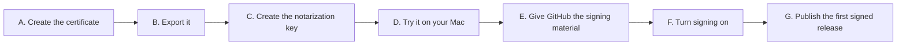
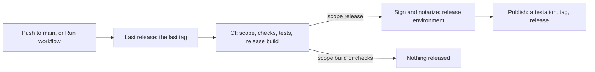

# Continuous integration and releases

This page is for maintainers. It says how to ship a new version of Arrumator, how to set up and look after the
Developer ID that signs it, and what to do when a release fails. It also describes how every pull request is checked,
because a release is built by those same checks.

It has four parts, one for each kind of need:

| Part | Read it when you want to |
|---|---|
| [How-to guides](#how-to-guides) | Get one job done, step by step. |
| [Troubleshooting](#troubleshooting) | Fix a release or a signing step that failed, starting from the message you see. |
| [Reference](#reference) | Look up a scope, a job, a file, a secret or a setting. |
| [How releases work](#how-releases-work) | Understand why the pipeline is built as it is, before you change it. |

## How-to guides

| You want to | Guide | How often |
|---|---|---|
| Ship merged code to users | [Release a new version](#release-a-new-version) | Every code change |
| Check that a release is signed, notarized and intact | [Verify a release](#verify-a-release) | After each release |
| Release again after a run failed or was skipped | [Run a release by hand](#run-a-release-by-hand) | When needed |
| Sign releases with the team's Developer ID | [Set up Developer ID signing](#set-up-developer-id-signing) | Once |
| Try signing and notarization without publishing | [Build and sign a release on your Mac](#build-and-sign-a-release-on-your-mac) | When the release scripts change |
| Move to version 0.2, 1.0 and so on | [Start a new version series](#start-a-new-version-series) | Rarely |
| Renew the certificate, replace the key, or sign ad hoc for a while | [Look after the signing credentials](#look-after-the-signing-credentials) | Every few years, or after a leak |

Every guide lists what you need before you start, then numbered steps of one action each. Where a step has a visible
outcome, **Result** says what you should see; when you see something else, stop and look it up in
[Troubleshooting](#troubleshooting). Text in angle brackets, such as `<version>`, is a value you fill in.

### Release a new version

You don't build or upload anything yourself: merging a code change into `main` releases it. This guide sees it through.

**Before you start:**

- The change has a pull request that is green locally and on CI, as the [push protocol](../AGENTS.md#8-push-protocol)
  requires.
- You can merge pull requests in `hlistan/arrumator`, and the [GitHub CLI](https://cli.github.com) is signed in
  (`gh auth status`).

**Steps:**

1. On the pull request's branch, find out whether merging it releases anything. The release takes everything since the
   last release's tag, so ask from there, as the workflow does:

   ```sh
   git fetch --tags origin
   scripts/change-scope.sh "$(git describe --tags --abbrev=0 --match 'v[0-9]*' origin/main)"
   ```

   **Result:** `release` means the merge publishes a version, of this change or of code merged before it and not yet
   released; go on. `build` or `checks` means the merge publishes nothing: merge it as usual and stop here.

2. Merge the pull request:

   ```sh
   gh pr merge --squash --delete-branch
   ```

3. Bring your copy of `main` up to date:

   ```sh
   git switch main && git pull --ff-only
   ```

4. Find the Release run the merge started:

   ```sh
   gh run list --workflow release.yml --limit 1 --repo hlistan/arrumator
   ```

   **Result:** a run titled like your pull request. If it shows the run before, wait a few seconds and list again.

5. Follow the run until it ends:

   ```sh
   gh run watch <run ID> --repo hlistan/arrumator
   ```

   **Result:** every job ends green, the last two being *Sign and notarize* and *Publish*. CI takes the longest, up to
   90 minutes; notarization usually takes a few minutes, and the job allows it an hour.

6. Look at the release:

   ```sh
   gh release view --repo hlistan/arrumator
   ```

   **Result:** the title is `Arrumator <version>`, with four files: two app zips, the command's zip and `SHA256SUMS`.
   The notes start by saying how it is signed, such as "Signed with a Developer ID and notarized by Apple".

7. [Verify the release](#verify-a-release).

**Done when** the release is marked **Latest** on the [releases page](https://github.com/hlistan/arrumator/releases)
and passes [Verify a release](#verify-a-release). If a job failed, look up its message in
[Troubleshooting](#troubleshooting), fix the cause, then [run the release by hand](#run-a-release-by-hand).

### Verify a release

Checks that the files are the ones the workflow built, that both apps are signed and notarized, and that macOS opens
them.

**Before you start:**

- A Mac with the [GitHub CLI](https://cli.github.com).
- The release's version. The latest one's tag is what this prints:
  `gh release view --json tagName --jq .tagName --repo hlistan/arrumator`.

**Steps:**

1. Download the release into a new folder, and go there:

   ```sh
   gh release download v<version> --repo hlistan/arrumator --dir ~/Downloads/arrumator-<version>
   cd ~/Downloads/arrumator-<version>
   ```

2. Check the checksums:

   ```sh
   shasum -a 256 -c SHA256SUMS
   ```

   **Result:** each of the three zips ends with `OK`.

3. Check that each zip was built by this repository's workflow:

   ```sh
   for zip in *.zip; do gh attestation verify "$zip" --repo hlistan/arrumator; done
   ```

   **Result:** `Verification succeeded!` three times.

4. Unpack both apps:

   ```sh
   for variant in universal apple-silicon; do mkdir "$variant" && ditto -x -k Arrumator-*-"$variant".zip "$variant"; done
   ```

5. Ask Gatekeeper about both apps:

   ```sh
   for variant in universal apple-silicon; do spctl -a -vv -t exec "$variant/Arrumator.app"; done
   ```

   **Result**, for a release signed with a Developer ID: `accepted` and `source=Notarized Developer ID` for **both**
   apps, with `origin=` naming the certificate in the `DEVELOPER_ID` secret. A release signed ad hoc is `rejected`,
   which is expected: its users allow it once, as [README › Install](../README.md#install) says. For such a release,
   stop here: steps 6–8 check what only a Developer ID gives.

6. Check the ticket stapled to each app, which lets it open offline:

   ```sh
   for variant in universal apple-silicon; do xcrun stapler validate "$variant/Arrumator.app"; done
   ```

   **Result:** `The validate action worked!` twice.

7. Check the command:

   ```sh
   ditto -x -k arrumatorcli-*.zip . && ./arrumatorcli-*/arrumatorcli --version
   codesign -dvv ./arrumatorcli-*/arrumatorcli 2>&1 | grep -E '^(Authority|Timestamp)='
   ```

   **Result:** the version, then `Authority=Developer ID Application: …` and a `Timestamp=`. A command-line tool cannot
   carry a stapled ticket: macOS asks Apple about it online the first time it runs.

8. Open it as a user would: on a Mac that has never had Arrumator, download the universal zip in Safari from the
   [releases page](https://github.com/hlistan/arrumator/releases), unzip it and open **Arrumator**.

   **Result:** macOS asks once whether to open an app downloaded from the Internet, and opens it. It does not send you
   to **System Settings › Privacy & Security › Open Anyway**.

**Done when** every result above matches, or, for a release signed ad hoc, the results of steps 2–5.

### Run a release by hand

Use this when a release failed or was cancelled, as when it stopped because signing was not set up. A release takes
everything on `main` since the last one, so nothing is lost by releasing later.

**Steps:**

1. Fix what stopped the last run: look up its message in [Troubleshooting](#troubleshooting).

2. Start the workflow on `main`:

   ```sh
   gh workflow run release.yml --ref main --repo hlistan/arrumator
   ```

   Or, on GitHub: **Actions › Release › Run workflow**, with the branch `main`. Start a new run rather than using
   **Re-run jobs** on the failed one: a new run releases what `main` holds now.

3. Follow it from step 4 of [Release a new version](#release-a-new-version).

   **Result:** a new release; or, when `main` holds no code that is not released yet, a run whose *Sign and notarize*
   and *Publish* jobs are skipped. A skipped run means there is nothing to release. It is not a failure.

### Set up Developer ID signing

Signs every release with the team's Developer ID and has Apple notarize it, so macOS opens Arrumator without the
**Open Anyway** step. You do it once. Afterwards releases are signed on GitHub's runners, without anyone's Mac.

**Before you start:**

- A paid [Apple Developer Program](https://developer.apple.com/programs/) membership for the team. You must be its
  **Account Holder**, or an **Admin** the Account Holder has allowed to create Developer ID certificates.
- A Mac with Xcode 27 and this repository set up (`scripts/bootstrap.sh`).
- Admin access to `hlistan/arrumator`, and the GitHub CLI signed in (`gh auth status`).
- A password manager for the files and passwords this creates, and the rules in
  [Keep the signing material secret](#keep-the-signing-material-secret).
- About an hour.

You collect these values on the way. Keep each in the password manager as soon as you have it:

| Value | What it looks like | Step | Secret |
|---|---|---|---|
| Certificate name | `Developer ID Application: <team name> (<team ID>)` | A5 | No: every app it signs shows it. |
| Certificate file | `DeveloperID.p12` | B3 | **Yes** |
| Certificate password | A password you choose | B4 | **Yes** |
| Notarization key | `AuthKey_<key ID>.p8` | C3 | **Yes** |
| Key ID | Ten letters and digits | C4 | No, but keep it with the key. |
| Issuer ID | A UUID | C4 | No, but keep it with the key. |

The steps fall into seven parts, in this order. A step is named by its part and number: B3 is the third step of
part B.



#### A. Create the certificate

1. In Keychain Access, choose **Keychain Access › Certificate Assistant › Request a Certificate From a Certificate
   Authority…**. Enter your email address and the team's name, choose **Saved to disk**, and save the request.
2. In your [developer account](https://developer.apple.com/account/resources/certificates/list), under
   **Certificates**, click **+**.
3. Choose **Developer ID Application** and click **Continue**. Choose the profile type **G2 Sub-CA**, upload the
   request, and click **Continue**. The other profile type, **Previous Sub-CA**, makes a certificate that stops working
   on 1 February 2027, when that authority expires.
4. Download the certificate and double-click it. Keychain Access adds it to the login keychain, beside the private
   key the request made.
5. In Terminal, list the identities this Mac can sign with:

   ```sh
   security find-identity -v -p codesigning
   ```

   **Result:** a line ending in `"Developer ID Application: <team name> (<team ID>)"`. The text between the quotes is
   the certificate name.

6. Check which authority issued the certificate, and when it ends:

   ```sh
   security find-certificate -c "<certificate name>" -p | openssl x509 -noout -issuer -enddate
   ```

   **Result:** the issuer includes `OU=G2`, and `notAfter=` is about five years away. If the issuer has no `OU=G2` and
   the certificate ends on 1 February 2027, it was made under the previous authority: make another, choosing
   **G2 Sub-CA**.

#### B. Export the certificate with its private key

1. Open **Keychain Access**, then the **login** keychain and the **My Certificates** tab.
2. Click the arrow beside the Developer ID Application certificate: a private key must be under it. Select the
   certificate's row, not the key's.
3. Choose **File › Export Items…**, choose the format **Personal Information Exchange (.p12)**, and save it as
   `~/Downloads/DeveloperID.p12`, outside the repository folder.
4. Enter a new, strong password when asked. Save the file and the password in the password manager.

#### C. Create the notarization key

1. Sign in to [App Store Connect](https://appstoreconnect.apple.com) and open **Users and Access › Integrations ›
   App Store Connect API**, then the **Team Keys** tab. The first time, the Account Holder has to click
   **Request Access**.
2. Click **+**. Name the key `Arrumator notarization`, set **Access** to **Developer**, and click **Generate**.
3. Click **Download** beside the key. You get `AuthKey_<key ID>.p8` in `~/Downloads`. Apple lets you download it
   **only once**: save it in the password manager now.
4. Copy the key's **Key ID** from its row, and the **Issuer ID** shown above the table, into the same entry.

#### D. Try it on your Mac

This signs and notarizes a release on your Mac and publishes nothing, so a mistake in parts A–C shows up here rather
than in a release.

1. Save the notarization key in your login keychain under the profile name `arrumator-notary`:

   ```sh
   xcrun notarytool store-credentials arrumator-notary \
     --key ~/Downloads/AuthKey_<key ID>.p8 --key-id <key ID> --issuer <issuer ID>
   ```

   **Result:** `Success. Credentials validated.`, then `Credentials saved to Keychain.`

2. In the repository folder, build, sign and notarize a release:

   ```sh
   RELEASE_SIGNING=developer-id \
   DEVELOPER_ID="<certificate name>" \
   NOTARY_PROFILE=arrumator-notary \
   scripts/release.sh
   ```

   When macOS asks whether `codesign` may use the key, enter your login password and click **Always Allow**.

   **Result:** after the build and one notarization, which often takes a few minutes, it prints
   `Signed and packaged <version>:`, the four files it wrote into `dist/`, and the version.

3. Ask Gatekeeper about both apps it signed:

   ```sh
   for variant in universal apple-silicon; do spctl -a -vv -t exec "build/Release/stage/$variant/Arrumator.app"; done
   ```

   **Result:** `accepted` and `source=Notarized Developer ID`, twice.

#### E. Give GitHub the signing material

Run each command on its own. A command that asks for a value takes whatever is pasted after it as the answer, so never
paste two at once.

1. Turn on branch rules for the `release` environment, which is about to hold the secrets. The repository is public
   and a workflow on any branch can name an environment, so the rules come before any secret:

   ```sh
   gh api --method PUT repos/hlistan/arrumator/environments/release --input - <<'JSON'
   {"deployment_branch_policy": {"protected_branches": false, "custom_branch_policies": true}}
   JSON
   ```

   **Result:** GitHub answers with the environment, whose `deployment_branch_policy` has
   `"custom_branch_policies":true`.

2. Admit `main` alone:

   ```sh
   gh api --method POST repos/hlistan/arrumator/environments/release/deployment-branch-policies -f name=main -f type=branch
   ```

   **Result:** this prints `main` alone:

   ```sh
   gh api repos/hlistan/arrumator/environments/release/deployment-branch-policies --jq '.branch_policies[].name'
   ```

   Steps E1 and E2 in the browser: in **Settings › Environments › `release`**, under **Deployment branches and tags**,
   choose **Selected branches and tags**, then add a rule for `main`
   ([GitHub Docs: deployment branches](https://docs.github.com/en/actions/how-tos/deploy/configure-and-manage-deployments/manage-environments)).

3. Add the certificate's name. Without `--body`, `gh secret set` asks for the value, so it never lands in your
   shell's history; paste the certificate name when it asks:

   ```sh
   gh secret set DEVELOPER_ID --env release --repo hlistan/arrumator
   ```

   **Result:** `gh` says it set `DEVELOPER_ID`.

4. Add the certificate:

   ```sh
   base64 -i ~/Downloads/DeveloperID.p12 | gh secret set DEVELOPER_ID_CERTIFICATE_P12 --env release --repo hlistan/arrumator
   ```

   **Result:** `gh` says it set `DEVELOPER_ID_CERTIFICATE_P12`.

5. Add the certificate's password; paste the `.p12`'s password when it asks:

   ```sh
   gh secret set DEVELOPER_ID_CERTIFICATE_PASSWORD --env release --repo hlistan/arrumator
   ```

   **Result:** `gh` says it set `DEVELOPER_ID_CERTIFICATE_PASSWORD`.

6. Add the notarization key:

   ```sh
   gh secret set NOTARY_KEY_P8 --env release --repo hlistan/arrumator < ~/Downloads/AuthKey_<key ID>.p8
   ```

   **Result:** `gh` says it set `NOTARY_KEY_P8`.

7. Add the key ID; paste it when it asks:

   ```sh
   gh secret set NOTARY_KEY_ID --env release --repo hlistan/arrumator
   ```

   **Result:** `gh` says it set `NOTARY_KEY_ID`.

8. Add the issuer ID; paste it when it asks:

   ```sh
   gh secret set NOTARY_ISSUER --env release --repo hlistan/arrumator
   ```

   **Result:** `gh secret list --env release --repo hlistan/arrumator` lists all six names.

   Steps E3–E8 in the browser: in **Settings › Environments › `release`**, click **Add environment secret** once for
   each, with the same name and value. For `DEVELOPER_ID_CERTIFICATE_P12`, paste the text
   `base64 -i ~/Downloads/DeveloperID.p12 | pbcopy` copies; for `NOTARY_KEY_P8`, the `.p8` file's whole text.

9. Delete the copies outside the password manager:

   ```sh
   rm ~/Downloads/DeveloperID.p12 ~/Downloads/AuthKey_<key ID>.p8
   ```

   The notarization profile from step D1 stays in your keychain, for when you next sign on your Mac.

#### F. Turn signing on

1. Only once steps E3–E8 are done, so no release starts with the secrets half set, say that releases are signed with the
   Developer ID:

   ```sh
   gh variable set RELEASE_SIGNING --env release --body developer-id --repo hlistan/arrumator
   ```

   **Result:** `gh variable list --env release --repo hlistan/arrumator` shows `RELEASE_SIGNING` as `developer-id`.

#### G. Publish the first signed release

1. The next release is signed. If `main` already holds code that is not released, [run the release by
   hand](#run-a-release-by-hand) now; otherwise it goes out with the next code change you merge.
2. [Verify the release](#verify-a-release).

**Done when** the release notes say "Signed with a Developer ID and notarized by Apple" and every check in
[Verify a release](#verify-a-release) passes.

### Build and sign a release on your Mac

Builds, signs and packages a release into `dist/` as the workflow does, and publishes nothing. Use it to try a change
to `scripts/build-release.sh` or `scripts/release.sh` before it reaches `main`. An agent asks before running it, as it
signs and notarizes with the team's Apple account ([AGENTS.md §4.8](../AGENTS.md#4-hard-rules-non-negotiable)).

**Before you start:** for a Developer ID build, parts A–D of [Set up Developer ID signing](#set-up-developer-id-signing)
are done on this Mac.

**Steps:**

1. Say how to sign. Ad hoc needs no Apple account:

   ```sh
   export RELEASE_SIGNING=ad-hoc
   ```

   A Developer ID build needs the certificate and the notarization profile:

   ```sh
   export RELEASE_SIGNING=developer-id DEVELOPER_ID="<certificate name>" NOTARY_PROFILE=arrumator-notary
   ```

2. Build and sign:

   ```sh
   scripts/release.sh
   ```

   To sign what `scripts/build-release.sh` has already built, give its folder: `scripts/release.sh build/Release/stage`.

   **Result:** it ends with `Signed and packaged <version>:` and the files in `dist/`.

3. For a Developer ID build, ask Gatekeeper about both apps, as in step D3 of the setup.

**Done when** `dist/` holds the three zips and `SHA256SUMS`. Git ignores `dist/` and `build/`; delete them when you
no longer need them.

### Start a new version series

A version is `MAJOR.MINOR.PATCH`. You choose `MAJOR.MINOR`; the patch number is counted for you ([Versions](#versions)).

1. On a branch, change `MARKETING_VERSION` in `project.yml`, for example from `"0.1.0"` to `"0.2.0"`. Leave the patch
   number at `0`; the build replaces it.
2. Deliver the change through the [push protocol](../AGENTS.md#8-push-protocol). `project.yml` counts as code, so the
   merge releases `0.2.<patch>` at once.

### Look after the signing credentials

| When | Do this |
|---|---|
| The certificate nears its end date, five years after it was made. Step A6 shows when it ends. | Make a new one (setup parts A and B). Replace `DEVELOPER_ID_CERTIFICATE_P12` and `DEVELOPER_ID_CERTIFICATE_PASSWORD` as in steps E4 and E5, and `DEVELOPER_ID` (step E3) if the name changed. Releases signed before keep opening: their signatures carry a secure timestamp. |
| You want a new notarization key, or someone who had the key leaves. | Make a new key (setup part C). Replace `NOTARY_KEY_P8` and `NOTARY_KEY_ID` (steps E6 and E7), save the profile again (step D1), then click **Revoke** beside the old key in App Store Connect. |
| The `.p8` file may have leaked. | Revoke the key in App Store Connect at once, then make a new one as above. |
| The `.p12` file and its password may have leaked. | Ask [Apple Developer Support](https://developer.apple.com/contact/) how to revoke the certificate: revoking it can stop releases signed with it from opening. Then make a new one as above. |
| You must release while Developer ID signing is broken. | `gh variable set RELEASE_SIGNING --env release --body ad-hoc --repo hlistan/arrumator`. The release notes then tell users to allow the app once. Set it back to `developer-id` when it is fixed. |

## Troubleshooting

Find the message you see, then do what the last column says.

### On your Mac

| You see | Why | Do this |
|---|---|---|
| `security find-identity` lists `0 valid identities found`, or Keychain Access says the certificate is not trusted. | The private key is not on this Mac (the certificate was made on another), or the Developer ID intermediate certificate is missing. | Import the `.p12` from the Mac that made it, or make a new certificate. Install **Developer ID - G2** from [Apple PKI](https://www.apple.com/certificateauthority/). |
| The certificate ends on 1 February 2027, and its issuer has no `OU=G2` (step A6). | It was made under Apple's previous Developer ID authority, which expires then. | Make a new one, choosing **G2 Sub-CA** (part A), and replace the secrets as in steps E4 and E5. Releases already signed keep opening. |
| `codesign` says the identity is `ambiguous`. | Two certificates in your keychains have the same name, as after making a new one. | Once the new one works, delete the old one from Keychain Access, or set `DEVELOPER_ID` to the new one's SHA-1 hash, which `security find-identity -v -p codesigning` shows. |
| `codesign` fails with `errSecInternalComponent`. | The login keychain is locked, or there is no window to ask for the key, as over SSH. | Run the script in Terminal on the Mac itself, or first run `security unlock-keychain ~/Library/Keychains/login.keychain-db`. |
| `notarytool store-credentials` fails with `401` or `Unable to authenticate`. | The key file, key ID or issuer ID is wrong, or the key was revoked. | Check the three values against App Store Connect, then run step D1 again. |
| `spctl` says `rejected` and `source=Unnotarized Developer ID`. | Apple holds no ticket that names this app's code: it was not notarized, it changed after notarization, or a later submission of the same code replaced its ticket. | Build and sign again with `scripts/release.sh`, which notarizes everything in one submission ([why](#one-notarization-for-every-download)). Never notarize one of the apps on its own. |
| `spctl` says `a sealed resource is missing or invalid`. | Something in the app changed after it was signed. | Build and sign again; change nothing inside the app afterwards. |

### In `scripts/release.sh`

| You see | Why | Do this |
|---|---|---|
| `release: set RELEASE_SIGNING to developer-id or ad-hoc` | `RELEASE_SIGNING` is not set, or has another value. | Set it ([Signing](#signing)). |
| `release: RELEASE_SIGNING is developer-id but DEVELOPER_ID is not set` | No certificate is named. | Set `DEVELOPER_ID` to the certificate name. |
| `release: a Developer ID release is notarized: set NOTARY_PROFILE, or NOTARY_KEY, NOTARY_KEY_ID and NOTARY_ISSUER` | No notarization credentials. | Set `NOTARY_PROFILE` (step D1), or the three others. |
| `release: RELEASE_SIGNING is ad-hoc but DEVELOPER_ID is set; say developer-id to sign with it` | Both were given, which would leave how it signs unclear. | `unset DEVELOPER_ID`, or say `developer-id`. |
| Apple's log, then `release: Apple did not accept <file>: Invalid` | Apple's checks failed. | Read the log above the message: each issue names the file and what is wrong. |
| `release: notarytool could not submit <file> or did not hear back within 1h` | Apple could not be reached, or took longer than an hour. | `xcrun notarytool history --keychain-profile arrumator-notary` shows the submission; when Apple is answering again, run the script again. |
| `release: Gatekeeper rejects <app>: …` | Gatekeeper refuses the signed, stapled app. With `source=Unnotarized Developer ID`, Apple holds no ticket that names its code. | Build and sign again from a fresh build, `scripts/release.sh` with no folder, and change nothing in `build/Release/stage` meanwhile. |
| `release: Gatekeeper accepts <app>, but not as notarized: …` | Gatekeeper accepted it for another reason, which proves nothing about the notarization. `spctl --status` says `assessments disabled` when Gatekeeper is off on that Mac. | On a Mac, turn Gatekeeper back on, or sign on another Mac. On GitHub's runner, where no Developer ID release has run yet to show whether Gatekeeper is on, nothing was published: open an issue with the job's log, and release ad hoc meanwhile ([Look after the signing credentials](#look-after-the-signing-credentials)). |
| `release: <path> still allows a debugger to attach` | The signed code kept the `get-task-allow` entitlement of a local build, which notarization refuses. | Look at what changed in how `scripts/release.sh` signs. |

### In the Release workflow

| You see | Why | Do this |
|---|---|---|
| `Set the release environment's variable RELEASE_SIGNING to developer-id or ad-hoc` | The variable is missing. | Step F1, or `ad-hoc`. Then [run the release by hand](#run-a-release-by-hand). |
| `RELEASE_SIGNING is developer-id, but the release environment lacks the secrets for: <names>` | Those secrets are missing or empty. | Set them as in steps E3–E8, then run the release by hand. |
| `Branch "<name>" is not allowed to deploy to release due to environment protection rules` | The run was not on `main`. | Run it on `main`. |
| `… is not on this runner image; choose an Xcode it has` | GitHub's runner image no longer has the pinned Xcode. | See [Tools and runners](#tools-and-runners). |
| *Sign and notarize* and *Publish* are skipped. | `main` holds no code that is not released yet. | Nothing: the next code change is released. |

## Reference

### What a change needs: `scripts/change-scope.sh`

Building the app, running every test and looking for unused code take most of a run, and a release adds signing,
notarization and a tag. A change needs them only when it can change what they check or produce.
`scripts/change-scope.sh <base>` reads which files a change touches and says which of three scopes it falls in:

| Scope | The change touches | What runs |
|---|---|---|
| `release` | Code, meaning what goes into the downloads: `Sources/` (the modules, with their bundled defaults and prompts), `App/`, `Package.swift`, `Package.resolved`, `project.yml`, `scripts/build-release.sh`, `scripts/release.sh`. | Every check, the build, every test and the release build; once merged, the release. |
| `build` | No code, but what builds, tests, checks or releases it: `Tests/` (with the fixtures), `Tools/`, `scripts/verify.sh`, `scripts/deadcode.sh`, `scripts/lint.sh`, `scripts/tools.sh` (the tools' pins), `scripts/change-scope.sh` itself, `.periphery.yml`, and both workflows. | Every check, the build, every test and the release build. Never released. |
| `checks` | Anything else: the documentation, the other scripts, the linters' and the secrets check's settings, `Brewfile`. | The static checks and the documentation check (`scripts/verify.sh --checks-only`), which builds only `arrumatorcli` to read its commands. |

The widest scope any file calls for wins. When Git cannot compare the change with its base, the scope is `release`,
so a change is never checked less than it needs. Run it before pushing to see which verify command applies:
`scripts/change-scope.sh main`.

CI decides a pull request's scope with the copy of this script on `main`, never with the pull request's own: a change
to the script, or to what it classes, is scoped as `main` classes it, and takes effect for the pull requests after it
is merged. That covers the scope alone. The workflow, `scripts/verify.sh` and the scripts it runs are the pull
request's own copies, so a change to them is checked by what it changes them to; such a change is scoped `build`,
checked in full, and reviewed before it reaches `main`.

### Pull requests: `.github/workflows/ci.yml`

A Scope job runs `main`'s `scripts/change-scope.sh` against the pull request's base, and two jobs check the change:

| Job | Runner | Time limit | What it runs |
|---|---|---|---|
| Scope | `ubuntu-24.04` | 5 minutes | The scope, as above. |
| Static checks | `xcode-27` | 20 minutes | `scripts/tools.sh`, then `scripts/lint.sh` (guideline gates, imports, secrets across the whole history, SwiftLint, ShellCheck, actionlint, zizmor, markdownlint, links, the commands the documents give and the variables of the shell functions), then `scripts/check-secrets.sh --range` over the pull request's commits, which also refuses machine-local commit identities. Every scope. |
| Build, test and look for unused code | `xcode-27` | 90 minutes | For `release` and `build`: `scripts/verify.sh --app --no-lint`, the package build, the documentation check, every test, `fixturegen --verify` on the corpus, the release build (the app for Apple silicon and Intel in the Release configuration, and the command) and Periphery. For `checks`: `scripts/verify.sh --checks-only --no-lint`, the documentation check alone. |

The repository's settings require both checks by name, so the build job always runs and reports, whatever the scope.
When the Scope job fails, the build job checks in full. Every job has a time limit, so a test or a tool that hangs fails
the run instead of holding a runner for GitHub's six hours.

### Releases: `.github/workflows/release.yml`

It runs on every push to `main`, and when it is run by hand on `main` (**Actions › Release › Run workflow**). It
releases only when the change since the last release's tag is scoped `release`. Its jobs hold only what each needs:

| Job | Holds | What it runs |
|---|---|---|
| Last release | Read access to the code | Finds the last release's tag. |
| CI | Read access to the code | The CI workflow above, on the change since the last release; its build job keeps what `scripts/build-release.sh` staged. |
| Sign and notarize | The `release` environment and its signing secrets | `scripts/release.sh` on the staged build: signs, notarizes, staples and packages. It compiles nothing and installs no tool. |
| Publish | The token that writes releases, and the attestation's identity | [`actions/attest`](https://github.com/actions/attest) on the downloads, so anyone can check one came from this repository's workflow (`gh attestation verify <file> --repo hlistan/arrumator`), then the tag `v<version>` and a release with generated notes and the files below. |

| File | Contents |
|---|---|
| `Arrumator-<version>-apple-silicon.zip` | The app for Apple silicon alone, the smaller download. |
| `Arrumator-<version>-universal.zip` | The app for Apple silicon and Intel Macs. |
| `arrumatorcli-<version>-apple-silicon.zip` | The command line tool and the resource bundles it reads, for Apple silicon. |
| `SHA256SUMS` | Checksums of all three: `shasum -a 256 -c SHA256SUMS`. |

Each download carries `NOTICES.txt`, inside the app (`Contents/Resources`) and beside the command: Arrumator's
licence, and the licence and notice files of every Swift package the build resolved (GRDB, Yams and ZIPFoundation
under MIT, swift-argument-parser under Apache 2.0), copied from the very versions the build used.

Releases run one after another (`concurrency: release`), never cancelled half-way. A merge scoped `build` or `checks`
goes out with the next release that changes code, whose generated notes list it too.

### Signing

How a release is signed is said, never inferred from which secrets happen to be set, so a lost secret stops the release
instead of quietly publishing it signed less. The `release` environment's variable `RELEASE_SIGNING` says it, and
`gh variable list --env release --repo hlistan/arrumator` shows it:

| `RELEASE_SIGNING` | The release |
|---|---|
| `developer-id` | Signed with a Developer ID, with the hardened runtime and a secure timestamp, notarized by Apple in one submission, and the app stapled ([why one](#one-notarization-for-every-download)); Gatekeeper is asked about both apps once nothing more is submitted, and must answer that Apple notarized them, not only that it accepts them. The job stops, naming them, when any of the secrets below is missing, and when Apple does not accept the submission, printing Apple's log; it reads Apple's verdict, not only `notarytool`'s exit status, and gives notarization an hour. |
| `ad-hoc` | Signed ad hoc, not notarized. It runs, but macOS blocks it the first time, and each user has to allow it once (see [README › Install](../README.md#install)); the release notes say so. |
| unset or anything else | The release stops before signing. |

The `release` environment admits `main` alone and holds six secrets
([Repository settings](repository-settings.md#the-release-environment)); [setup](#set-up-developer-id-signing) steps
E3–E8 set them:

| Secret | Value |
|---|---|
| `DEVELOPER_ID` | The certificate's name, such as `Developer ID Application: <team name> (<team ID>)`. |
| `DEVELOPER_ID_CERTIFICATE_P12` | The Developer ID Application certificate with its private key, exported from Keychain Access as `.p12`, base64-encoded. |
| `DEVELOPER_ID_CERTIFICATE_PASSWORD` | The password the `.p12` was exported with. |
| `NOTARY_KEY_P8` | An App Store Connect API key's `.p8` file, as text (Users and Access › Integrations › App Store Connect API, access Developer). |
| `NOTARY_KEY_ID` | That key's ID. |
| `NOTARY_ISSUER` | The issuer ID shown above the keys. |

`scripts/release.sh` reads these environment variables, on a Mac and in the workflow alike:

| Variable | Value |
|---|---|
| `RELEASE_SIGNING` | `developer-id` or `ad-hoc`, as above. Always required. |
| `DEVELOPER_ID` | The certificate's name; the certificate and its private key must be in a keychain. Required for `developer-id`, refused for `ad-hoc`. |
| `NOTARY_PROFILE` | A profile saved with `xcrun notarytool store-credentials` (setup step D1). For `developer-id`, this or the next three. |
| `NOTARY_KEY`, `NOTARY_KEY_ID`, `NOTARY_ISSUER` | The `.p8` file's path, its key ID and the issuer ID. The workflow uses these. |

### Keep the signing material secret

| Material | Keep it in | Never put it in |
|---|---|---|
| The `.p12` and its password | The password manager, and the `release` environment's secrets. | The repository, an issue or pull request, a chat, a command line, a shared or synced folder. |
| The `.p8` | The password manager, the `release` environment's secret, and your login keychain (the notarization profile). | The same places. |
| The key ID and issuer ID | Beside the `.p8`. | Not secret alone, but useless apart from it. |
| The certificate name and team ID | Anywhere. | Nothing: every app the certificate signs shows them. |

What keeps them out of sight:

- `scripts/check-secrets.sh` refuses `.p12`, `.p8` and private keys in a commit, a push and every pull request, and
  GitHub's push protection refuses known kinds of secret on the server ([Repository settings](repository-settings.md)).
- Only the *Sign and notarize* job can read the secrets, and only on `main`: the environment admits no other branch,
  and a pull request from a fork never receives secrets.
- GitHub shows a secret's value in a log as `***`, but not a value made from it, so no step prints either. The job
  writes the certificate and the key into the runner's temporary folder, imports the certificate into a keychain of
  its own with a random password, and deletes both when the job ends, whether it failed or not.
- The job uploads `dist/` alone, which holds the downloads and their checksums; what is sent to Apple is zipped in a
  temporary folder.
- `gh secret set` without `--body` asks for the value instead of taking it from the command line. A command line typed
  with a secret in it is kept in the shell's history: Terminal keeps each window's history in `~/.zsh_sessions` and
  adds it to `~/.zsh_history` when the window closes. Delete such a line from both.

### Versions

`MARKETING_VERSION` in `project.yml` sets the major and minor version. The patch number is the number of commits on
`main`: with `0.1.0` in `project.yml`, the 42nd commit on `main` is `0.1.42`. Merges that change no code count too, so
patch numbers can skip: `0.1.42` may follow `0.1.39`. To start a new series, change the major or minor number in
`project.yml`. The app shows the version as `CFBundleShortVersionString`, with the patch number also as
`CFBundleVersion`. The command reads it from an Info.plist linked into its executable (`AppVersion`), and a development
build reports `dev`.

### Tools and runners

A check gives the same answer until someone changes it on purpose, so nothing it depends on moves by itself:

- **The tools** the checks and the build run are pinned in `scripts/tools.sh`: each at one version, downloaded from
  its publisher's release and refused unless its SHA-256 (for markdownlint-cli2, the npm registry's SHA-512 integrity)
  is the one written there. markdownlint-cli2's own dependencies are exact versions in its package.json, but npm
  resolves theirs when it installs, checked only against the registry's integrity: that tree is not pinned here.
  The tools are installed into `.tools/`, which Git ignores, and the scripts run them from `.tools/bin`;
  `scripts/lint.sh` fails when one is not installed at its pinned version. To move a tool to a newer release, change
  its row, with the checksum GitHub shows beside the download on the release's page, in a pull request of its own;
  Dependabot does not see these pins. `Brewfile` holds only Node.js, which markdownlint-cli2 runs on.
- **Xcode** is chosen by path, and each macOS job first checks the path is there and stops, naming this section, when
  it is not: every macOS job sets `DEVELOPER_DIR` to Xcode 27.0 on the runner image
  (`/Applications/Xcode_27.0.app`, build 27A266a, as GitHub's
  [image description](https://github.com/actions/runner-images/blob/main/images/macos/xcode-27-arm64-Readme.md)
  lists it), so a newer default Xcode on the image changes nothing until the path changes. Each build job prints the
  image's version, `xcodebuild -version` and `swift --version`.
- **The runners** are named by version, never `-latest`: `ubuntu-24.04`, and `xcode-27`, GitHub's image carrying Xcode
  27, [in public preview](https://github.blog/changelog/2026-07-16-xcode-27-runner-image-now-in-public-preview/).
  GitHub updates an image's other software weekly and offers no way to hold one image version.
- **Periphery**, which `scripts/deadcode.sh` runs, is no longer developed: its repository is archived,
  and Homebrew deprecated its formula on 2026-08-12 and will disable it on 2027-08-12
  ([formula](https://formulae.brew.sh/formula/periphery)). The pin installs the last release, 3.8.0, from its GitHub
  release with its checksum, which does not depend on Homebrew. It reads the index stores Xcode and SwiftPM write, so
  a later Xcode can change their format under it: when `scripts/deadcode.sh` fails for that reason rather than for
  unused code, the unused-code check moves to a maintained fork or another tool, in a change of its own that updates
  this section.

### Dependencies

Every build uses the Swift packages' versions in `Package.resolved` and refuses any other:
`swift build --force-resolved-versions` for the package, and for the app `xcodebuild
-onlyUsePackageVersionsFromResolvedFile` with the package's `Package.resolved` placed in the generated project. A new
version reaches a build only through a change to `Package.resolved`, reviewed like any other.

[Dependabot](../.github/dependabot.yml) proposes weekly updates to the pinned workflow actions and to the Swift
packages, waiting a week after each release of theirs. Workflow actions are pinned to full commit hashes, the only
immutable reference GitHub offers
([GitHub Docs: security hardening](https://docs.github.com/en/actions/reference/security/secure-use)). The tools in
`scripts/tools.sh` are updated by hand, as [Tools and runners](#tools-and-runners) describes.

## How releases work



### What `main` holds decides, not one push

On every push to `main` the workflow finds the last release's tag and scopes the change from it to `main`'s head. When
that scope is `release`, `main` is built, signed and published. A run that failed, was cancelled or never ran therefore
leaves nothing behind: the next push releases what it left, and a run by hand does the same at once.

### Each job holds only what it needs

The job that compiles holds no secret, the job that holds the signing key compiles nothing and installs no tool, and
only the job that publishes can write a release. Code from a pull request is never built where the key is.

### Signing is said, never inferred

The release is signed as `RELEASE_SIGNING` says. If it were inferred from which secrets are present, a secret lost or
mistyped would quietly publish a release macOS blocks; instead the release stops and names what is missing.

### One notarization for every download

The Apple-silicon app is the universal app with its Intel half removed, so the two apps share the Apple-silicon code,
byte for byte, and with it the code directory hash Apple's tickets name. Apple serves one ticket for a code directory
hash: the last one submitted. Notarized apart, the Apple-silicon app's ticket, which does not name the Intel code,
replaces the universal app's, and Gatekeeper then rejects the universal app as unnotarized, though a ticket is stapled
to it. `scripts/release.sh` therefore signs the two apps and the command first and sends them to Apple in a single
submission, whose one ticket names all their code, and asks Gatekeeper about both apps only after that submission, as
a later one could change its answer.

### Pull requests build what a release builds

`scripts/build-release.sh` compiles the app for both architectures in the Release configuration and the command in
release mode, on every pull request that changes code, as the release does. Neither the Intel slice nor optimized code
is first compiled after the merge; signing and notarization are the only steps a pull request does not run. It compiles
the app from scratch each time, its index store made anew, as the unused-code check (`scripts/deadcode.sh`) reads every
unit in that store: one a Debug build left in the same folder (CONTRIBUTING.md builds one there), or a build of a file
since renamed or removed, would read as code nothing uses, or as a use that hides code nothing uses.

GitHub's runners are virtual Macs, and Vision cannot recognise text on them on any device
(`TextRecognition.CRImageReaderError` 9, and an unknown error on the CPU). The tests that need real OCR, and the OCR
checks of `fixturegen --verify`, therefore say so and are skipped there, with that reason in the log; they run on every
physical Mac, which is why the push protocol starts with `scripts/verify.sh --app` on your own Mac. How the app handles
OCR failing, and its CPU fallback, is tested everywhere with a scripted recognizer (`OCRServiceTests`).

### Dependencies and tools never move by themselves

Every input of a build is pinned: the Swift packages in `Package.resolved`, the workflow actions by commit hash, the
tools by version and checksum, Xcode by path and the runners by name. A change to any of them is a reviewed change of
its own, so a release differs from the one before only by what was merged.
